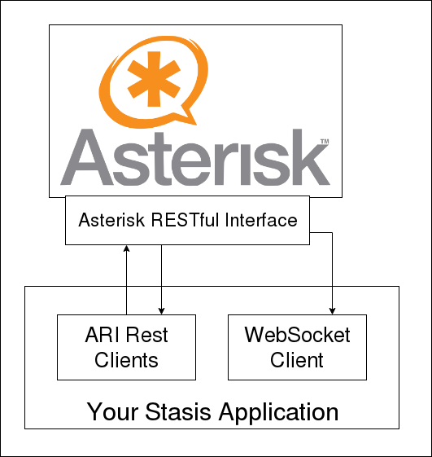

# Asterisk REST Interface (ARI) Client :telephone:
> Grab yourself some coffee and save plenty of time by using this object oriented ARI client library. 
Keeping your code nice and clean, taking care of easy RESTful calls to Asterisk and incoming events 
while you focus on developing your Stasis apps.

`Implemented and tested for Asterisk 16!`

## Installation
Use this library with composer and include it into your composer.json by using the terminal command
`composer require ng-voice/asterisk-ari-client`

##### PHP extensions
You might run into troubles with missing php extensions. The following are required:
We recommend to install them with terminal commands. E.g. for Debian: `apt install php7.2-mbstring` 
(may differ depending on your underlying operating system. Don't forget to restart your apache 
server with `service apache2 restart`

For performance increase also install the PECL extension libevent. It makes the WebSocketClient faster!

##### Asterisk
You will have to start a running asterisk instance first and configure it to use it's light http server and the 
"Asterisk RESTful Interface" (ARI). The official Asterisk documentation shows you how to configure http.conf and 
ari.conf in order to use ARI. Alternatively use the provided Dockerfile. Ready to use!

## Features
#### ARI Clients
Talk to your asterisk instance by using the given well documented http clients.

#### ARI web socket message model mapping
A WebSocketClient connects to Asterisk via `GET /events` and subscribes either to one, many or all 
stasis application events. 
If you choose to write a local app (see examples/ExampleLocalApp), events will be mapped onto objects and are 
therefore easy to access/handle. No need to touch any JSON! I already did the work for you :)

#### Build your own apps
Using this client library for your own asynchronous applications is a piece of cake.
Simply extend the BasicStasisApp and design your Stasis app as you wish. Say goodbye to boilerplate code!

#### Ready to use Asterisk ARI Docker container
Preferably use the provided Dockerfile in this library to compile your own asterisk container.
    
    cd docker/asterisk
    docker build -t --build-arg asterisk_version=16.2.1 asterisk:latest .
    docker run -d --name some-asterisk -p 8088:8088 -p 5060:5060 -p 5060:5060/udp asterisk:latest

    !!! PLEASE NOTE !!!
    Compiling Asterisk sometimes is bound to the hardware you are compiling it on.
    Right now we compile an own container for every machine we run Asterisk on,
    to make sure it will work.
    Alternatively you can set generic compiler flags at your own risk.

If you choose to write a local app (see examples/ExampleLocalApp), Messages from Asterisk will be mapped onto 
ARI specific message objects and are easy to access/handle. No need to touch any JSON! I already did the work for you :)

## How to use
Two examples can be found in the example directory.

Basically there are two possibilities to handle incoming events from Asterisk, depending on what you would like to do 
with them:

* To write a local standalone script for simple event handling (like in ExampleLocalApp)
* Pass events to a remote app, e.g. if you are wrapping Asterisk with an own RESTful Interface
(like with example_worker_remote_app)

Now, how should we handle events, that are sent to our WebSocketClient workers?

Out of the box you can use the `LocalAppMessageHandler` (handling event objects in a local App) 
or the `RemoteAppMessageHandler` (sending events to another API) but of course you can write your own.

## Tests
Execute the following command in the downloaded repository:

    ./vendor/bin/phpunit

##Licence
MIT

##Contact
ng-voice is happy to help! Feel free to send me a message.
I'd also love to hear about your application ideas and use cases :)

Lukas Stermann (lukas@ng-voice.com)